# Traffic Light State Flow Diagram

This diagram shows the finite state machine for the traffic light system implementation using the State design pattern.

```mermaid
stateDiagram-v2
    [*] --> Red
    
    Red --> Green: handle_timer() / 3 seconds elapsed
    Green --> Yellow: handle_timer() / 4 seconds elapsed  
    Yellow --> Red: handle_timer() / 1 second elapsed
    
    Red: 🔴 RED LIGHT
    Red: Duration 3 seconds
    Red: Can Cross ❌ NO
    
    Green: 🟢 GREEN LIGHT
    Green: Duration 4 seconds
    Green: Can Cross ✅ YES
    
    Yellow: 🟡 YELLOW LIGHT
    Yellow: Duration 1 second
    Yellow: Can Cross ❌ NO
    
    note right of Red
        Vehicles and pedestrians
        must STOP and wait
        Safety critical state
    end note
    
    note right of Green
        Safe to proceed
        Vehicles and pedestrians
        can cross intersection
    end note
    
    note right of Yellow
        Caution - prepare to stop
        Do not enter intersection
        Transition warning
    end note
```

## Alternative Simplified Diagram

```mermaid
flowchart LR
    A[🔴 Red Light<br/>3 seconds<br/>❌ Do Not Cross] --> B[🟢 Green Light<br/>4 seconds<br/>✅ Safe to Cross]
    B --> C[🟡 Yellow Light<br/>1 second<br/>❌ Do Not Cross]
    C --> A
    
    style A fill:#ffcccc,stroke:#cc0000,stroke-width:2px
    style B fill:#ccffcc,stroke:#00cc00,stroke-width:2px
    style C fill:#ffffe0,stroke:#cccc00,stroke-width:2px
```

## State Cycle Overview

The traffic light follows a simple, predictable cycle:

1. **Red Light** (3 seconds) → **Green Light** (4 seconds) → **Yellow Light** (1 second) → Back to **Red Light**

## Gang of Four State Pattern Implementation

This traffic light demonstrates the **State Pattern** from the Gang of Four design patterns:

### Pattern Components

- **Context**: `TrafficLight` class
  - Maintains reference to current state
  - Delegates behavior to state objects
  - Manages timer and state transitions

- **State Interface**: `TrafficLightState` abstract base class
  - Defines common interface for all concrete states
  - Methods: `handle_timer()`, `get_color()`, `get_duration()`, `can_cross()`

- **Concrete States**: 
  - `RedLightState` - Stop behavior
  - `GreenLightState` - Go behavior  
  - `YellowLightState` - Caution behavior

### Key Benefits

✅ **Eliminates complex conditionals** - No giant if/else for state logic  
✅ **Encapsulates state-specific behavior** - Each state handles its own logic  
✅ **Makes state transitions explicit** - Clear, controlled state changes  
✅ **Easy to extend** - Add new states (e.g., FlashingRed) without modifying existing code  
✅ **Single responsibility** - Each state class has one clear purpose  

### Finite State Machine Characteristics

- **Deterministic**: Given current state and input, next state is predictable
- **Cyclic**: States repeat in a continuous loop
- **Timer-driven**: Transitions occur based on elapsed time
- **Safety-focused**: Clear rules for when crossing is permitted

### Implementation Details

Following the **Gang of Four State Pattern**:
- Each state encapsulates its own behavior and transition logic
- The context (`TrafficLight`) delegates all state-specific operations
- States are interchangeable objects that implement the same interface
- Adding new states (like emergency flashing) requires no changes to existing code