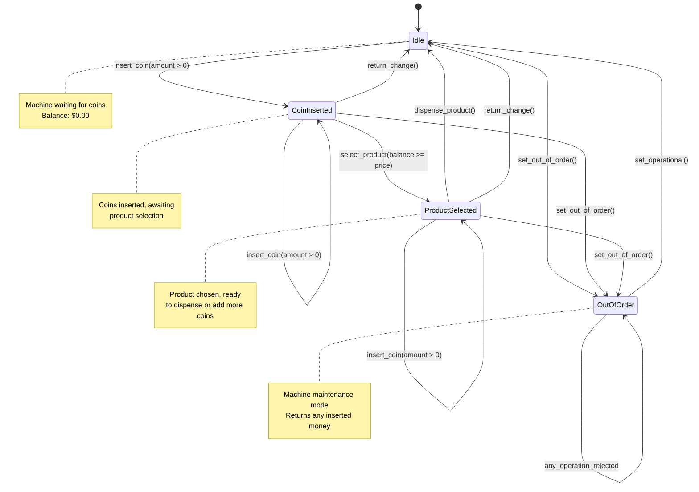

# Vending Machine State Flow Diagram

This diagram shows the finite state machine for the vending machine implementation using the State design pattern.

## State Descriptions

- **Idle**: Initial state, waiting for coins
- **CoinInserted**: Money inserted, waiting for product selection
- **ProductSelected**: Product chosen with sufficient funds, ready to dispense
- **OutOfOrder**: Maintenance mode, all operations rejected except money return

## Key Transitions

1. **insert_coin()** - Add money to machine balance
2. **select_product()** - Choose a product (requires sufficient balance)
3. **dispense_product()** - Complete transaction and return to idle
4. **return_change()** - Cancel transaction and refund money
5. **set_out_of_order()** - Enter maintenance mode
6. **set_operational()** - Return to normal 